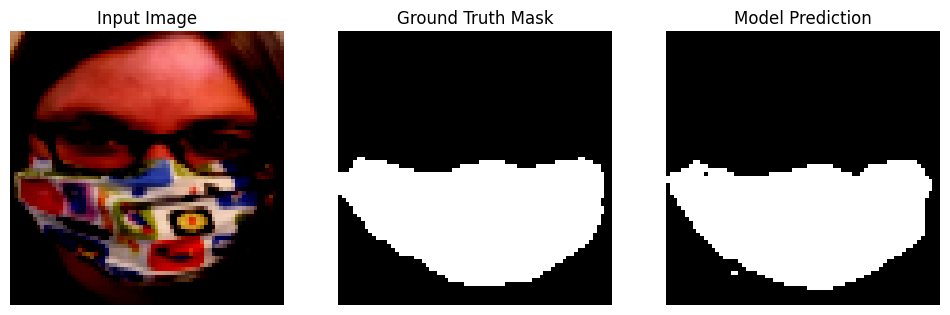
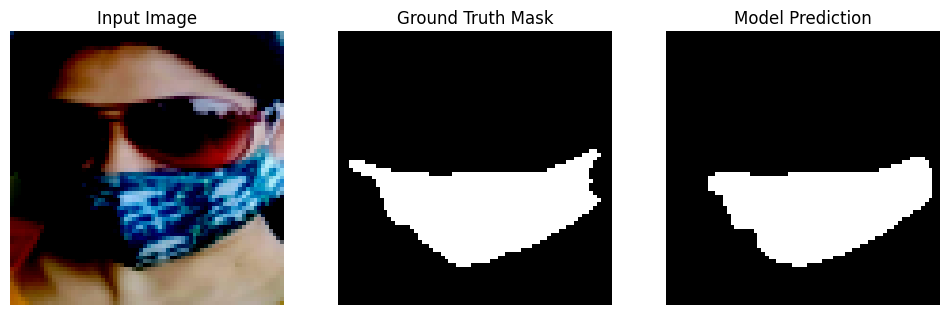

Develop a Computer Vision Solution for Face Mask Classification and Segmentation

**Project Overview**:
The goal of this project is to build a computer vision solution for classifying and segmenting face masks in images. This will involve a combination of handcrafted features with machine learning classifiers and deep learning techniques for both classification and segmentation tasks.

**Datasets**:
1. **Face Mask Detection Dataset**: This labeled dataset contains images of people with and without face masks. It can be accessed from the following repository: [Face Mask Detection Dataset](https://github.com/chandrikadeb7/Face-Mask-Detection/tree/master/dataset).
  
2. **Masked Face Segmentation Dataset**: This dataset contains images of faces with ground truth face masks for segmentation tasks. The dataset can be accessed from: [Masked Face Segmentation Dataset](https://github.com/sadjadrz/MFSD).

## Setting up the dataset
---------------------------------------------

1.  Open a terminal or command prompt on your operating system.

2.  Navigate to the directory where you cloned this repo.

3.  Run the below command, and press Enter to execute it.
```
pip install gdown
python setup-dataset.py
```

Two datasets will be downloaded in a `FaceMaskDataset` folder.
1. Detection and classification dataset will be in `dataset` folder.
2. Segmentation dataset will be in a zip file `MaskedFaceSegmentation.zip`, extract it manually.

Task wise folders are created, we can add our code into the respective folders.

## Task A
```
Binary Classification Using Handcrafted Features and ML Classifiers (4 Marks)
i. Extract handcrafted features from the dataset.
ii. Train and evaluate at least two machine learning classifiers (e.g., SVM, Neural
network) to classify faces as "with mask" or "without mask."
iii. Report and compare the accuracy of the classifiers.
```
The dataset count used for training and testing were as:
```
Train Set:
  No Mask (0): 1544
  Mask (1): 1572

Test Set:
  No Mask (0): 386
  Mask (1): 394
```

Image size of `64x64` was used.

Following features are extracted from the images:
- Apply the Sobel filter to detect horizontal and vertical edges.
- Extract HOG features to capture gradient orientation patterns.
- Extract LBP features to capture local texture information.
- Extract Gabor features for edge detection, texture classification, feature extraction and disparity estimation

Array shapes of the image, extracted features per image, and resulting dataset are as:
```
Image shape:  (64, 64)
Sobel feature shape:  (4096,)
HOG feature shape:  (324,)
LBP feature shape:  (256,)
Gabor feature shape:  (16384,)

Training features shape:   (3116, 21128)
Testing features shape:   (780, 21128)
```

PCA was applied on the training dataset generated above to reduce the number of features. Ideal number of components to reduce to was determined. With a threshold of 97% variance retention, a scree plot was generated for the same as:


Finally estimated optimal PCA components were `428`.

Post PCA shapes of the dataset:
```
Reduced Training features shape:   (3116, 428)
Reduced Testing features shape:   (780, 428)
```

The following models were trained with above data:
- SVM
- MLP
- Logistic regression
- Random forest

The results of each model after the final run are as shown:

### SVM

```
Training Accuracy: 0.9641  
Test Accuracy: 0.8641  
Confusion Matrix:
[[322  64]  
 [ 42 352]]
```
Classification Report (Test Set):

|               | Precision | Recall | F1-Score | Support |
|---------------|-----------|--------|----------|---------|
| 0             |    0.88   |   0.83 |   0.86   |   386   |
| 1             |    0.85   |   0.89 |   0.87   |   394   |
| Accuracy      |           |        |   0.86   |   780   |
| Macro avg     |    0.87   |   0.86 |   0.86   |   780   |
| Weighted avg  |    0.87   |   0.86 |   0.86   |   780   |


### MLP

```
Training Accuracy: 0.9791  
Test Accuracy: 0.8167 
Confusion Matrix:
[[323  63]  
 [ 80 314]] 
```
Classification Report (Test Set):

|               | Precision | Recall | F1-Score | Support |
|---------------|-----------|--------|----------|---------|
| 0             |    0.80   |   0.84 |   0.82   |   386   |
| 1             |    0.83   |   0.80 |   0.81   |   394   |
| Accuracy      |           |        |   0.82   |   780   |
| Macro avg     |    0.82   |   0.82 |   0.82   |   780   |
| Weighted avg  |    0.82   |   0.82 |   0.82   |   780   |

### Logistic

```
Training Accuracy: 0.8787  
Test Accuracy: 0.7744  
Confusion Matrix:
[[291  95]  
 [ 81 313]]
 ```

Classification Report (Test Set):

|               | Precision | Recall | F1-Score | Support |
|---------------|-----------|--------|----------|---------|
| 0             |    0.78   |   0.75 |   0.77   |   386   |
| 1             |    0.77   |   0.79 |   0.78   |   394   |
| Accuracy      |           |        |   0.77   |   780   |
| Macro avg     |    0.77   |   0.77 |   0.77   |   780   |
| Weighted avg  |    0.77   |   0.77 |   0.77   |   780   |

### Random forest

```
Training Accuracy: 1.0000  
Test Accuracy: 0.7782  
Confusion Matrix:
[[269 117]  
 [ 56 338]]
```

Classification Report (Test Set):

|               | Precision | Recall | F1-Score | Support |
|---------------|-----------|--------|----------|---------|
| 0             |    0.83   |   0.70 |   0.76   |   386   |
| 1             |    0.74   |   0.86 |   0.80   |   394   |
| Accuracy      |           |        |   0.78   |   780   |
| Macro avg     |    0.79   |   0.78 |   0.78   |   780   |
| Weighted avg  |    0.78   |   0.78 |   0.78   |   780   |


The consolidated results of all the experiments are as:
**Initial run:**

| Model | Train Acc | Test Acc | False Positives | False Negatives | F1-Score |
|-------|-----------|----------|-----------------|-----------------|----------|
| SVM   | 0.971117  | 0.851282 | 55              | 61              | 0.85     |
| MLP   | 1.000000  | 0.832051 | 57              | 74              | 0.83     |
| LR    | 0.899872  | 0.762821 | 83              | 102             | 0.76     |
| RF    | 1.000000  | 0.779487 | 113             | 59              | 0.78     |

**Applied normalization to features separately:**

| Model | Train Acc | Test Acc | False Positives | False Negatives | F1-Score |
|-------|-----------|----------|-----------------|-----------------|----------|
| SVM   | 0.922015  | 0.837179 | 57              | 70              | 0.84     |
| MLP   | 1.000000  | 0.834615 | 59              | 70              | 0.83     |
| LR    | 0.867779  | 0.751282 | 92              | 102             | 0.75     |
| RF    | 1.000000  | 0.793590 | 80              | 81              | 0.79     |

**Increasing images size from 64x64 to 96x96:**

| Model | Train Acc | Test Acc | False Positives | False Negatives | F1-Score |
|-------|-----------|----------|-----------------|-----------------|----------|
| SVM   | 0.907839  | 0.812412 | 44              | 89              | 0.81     |
| MLP   | 1.000000  | 0.815233 | 58              | 73              | 0.81     |
| LR    | 0.908898  | 0.796897 | 69              | 75              | 0.80     |
| RF    | 1.000000  | 0.775740 | 79              | 80              | 0.78     |

**Updated MLP parameters to reduce overfitting**

| Model | Train Acc | Test Acc | False Positives | False Negatives | F1-Score |
|-------|-----------|----------|-----------------|-----------------|----------|
| MLP   | 0.948799  | 0.830748 | 47              | 73              | 0.83     |

**Added Gabor features, removed normalization, 64x64 images:**

| Model | Train Acc | Test Acc | False Positives | False Negatives | F1-Score |
|-------|-----------|----------|-----------------|-----------------|----------|
| SVM   | 0.964056  | 0.864103 | 64              | 42              | 0.86     |
| MLP   | 0.979140  | 0.816667 | 63              | 80              | 0.82     |
| LR    | 0.878691  | 0.774359 | 95              | 81              | 0.77     |
| RF    | 1.000000  | 0.778205 | 117             | 56              | 0.78     |

**Conclusion**
- **SVM with Gabor features** achieved the highest performance with a test accuracy of **86.41%** and an F1-score of **0.86**.
- **MLP with updated parameters** also performed well, with a test accuracy of **81.67%** and an F1-score of **0.82**.
- **Normalization of features** slightly improved the results for SVM (test accuracy: **83.72%**, F1-score: **0.84**) and MLP (test accuracy: **83.46%**, F1-score: **0.83**).
- Increasing the image size from **64x64 to 96x96** did not significantly improve performance and in some cases, like for SVM, it led to a decrease in test accuracy (**81.24%**), indicating that the larger image size might add unnecessary complexity.
- **Logistic Regression** and **Random Forests** performed the worst, with test accuracies of **76.28%** and **77.87%**, respectively, highlighting their lower effectiveness in this task compared to SVM and MLP. 

Overall, the combination of **SVM with Gabor features** and **MLP with proper tuning** delivered the best results for face mask classification and segmentation.

---
## Task B

```
Binary Classification Using CNN (3 Marks)
i. Design and train a Convolutional Neural Network (CNN) to perform binary
classification on the same dataset.
ii. Try a few hyper-parameter variations (e.g., learning rate, batch size, optimizer,
activation function in the classification layer) and report the results.
iii. Compare the CNN's performance with the ML classifiers
```
We use the following CNN architecture:

```
CNN(
  (conv1): Conv2d(3, 16, kernel_size=(3, 3), stride=(1, 1), padding=(1, 1))
  (conv2): Conv2d(16, 32, kernel_size=(3, 3), stride=(1, 1), padding=(1, 1))
  (pool1): MaxPool2d(kernel_size=2, stride=2, padding=0, dilation=1, ceil_mode=False)
  (pool2): MaxPool2d(kernel_size=2, stride=2, padding=0, dilation=1, ceil_mode=False)
  (flatten): Flatten(start_dim=1, end_dim=-1)
  (fc1): Linear(in_features=2048, out_features=128, bias=True)
  (fc2): Linear(in_features=128, out_features=1, bias=True)
  (relu): ReLU()
  (sigmoid): Sigmoid()
)
```

The model was trained on mentioned dataset for `15` epochs. Binary Cross Entropy (BCELoss) is used as the loss function. Adam optimizer is used with a learning rate of 0.001.The training loss for it is as:
```
Epoch: 1  | Train Loss: 0.49768   
Epoch: 2  | Train Loss: 0.28832   
Epoch: 3  | Train Loss: 0.24126   
Epoch: 4  | Train Loss: 0.20209   
Epoch: 5  | Train Loss: 0.19256   
Epoch: 6  | Train Loss: 0.15997   
Epoch: 7  | Train Loss: 0.14257   
Epoch: 8  | Train Loss: 0.12698   
Epoch: 9  | Train Loss: 0.11578   
Epoch: 10 | Train Loss: 0.10098   
Epoch: 11 | Train Loss: 0.08440   
Epoch: 12 | Train Loss: 0.08050   
Epoch: 13 | Train Loss: 0.06951   
Epoch: 14 | Train Loss: 0.05980   
Epoch: 15 | Train Loss: 0.05703 
```

The graph of the same is as:


Accuracy and other related metrics obtained were as:
```
Train Accuracy : 97.62%
Test Accuracy : 95.24% 
AUC : 0.9537 
F1-Score : 0.9513
Confusion Matrix:
[[399  31]
 [  8 381]]
 ```

Experiments ran on the CNN yeilded the following results:

| Experiment | Learning Rate | Epochs | Optimizer | Train Accuracy | Test Accuracy | AUC Score | F1 Score | Confusion Matrix       |
|------------|---------------|--------|-----------|-----------------|----------------|-----------|----------|------------------------|
| 1          | 0.001         | 15     | adam      | 97.62%          | 95.24%         | 0.9537    | 0.9513   | [[399, 31], [8, 381]]  |
| 2          | 0.001         | 20     | adam      | 99.63%          | 95.85%         | 0.9583    | 0.9562   | [[414, 16], [18, 371]] |
| 3          | 0.001         | 10     | adam      | 97.62%          | 95.85%         | 0.9583    | 0.9562   | [[414, 16], [18, 371]] |
| 4          | 0.001         | 17     | adam      | 99.33%          | 95.12%         | 0.9514    | 0.9490   | [[407, 23], [17, 372]] |
| 5          | 0.002         | 15     | adam      | 98.75%          | 94.26%         | 0.9433    | 0.9406   | [[400, 30], [17, 372]] |
| 6          | 0.01          | 15     | adam      | 98.78%          | 94.38%         | 0.9438    | 0.9410   | [[406, 24], [22, 367]] |
| 7          | 0.01          | 20     | sgd       | 97.83%          | 94.38%         | 0.9431    | 0.9401   | [[412, 18], [28, 361]] |
| 8          | 0.02          | 20     | sgd       | 99.27%          | 94.02%         | 0.9412    | 0.9385   | [[396, 34], [15, 374]] |

```
The Model with Highest Test Accuracy:
==================================================
learning_rate: 0.001
epochs: 10
optimizer: adam
train_accuracy: 97.62
test_accuracy: 95.85
auc: 0.9582591020505768
f1_score: 0.9561855670103093
confusion Matrix:
[[414  16]
 [ 18 371]]
==================================================
Test and Train Accuracy is in %
```

The graphs of losses in the experiments can be found in the respective jupyter notebook. 

**Conclusion**

The highest test accuracy for SVM is 86.41%, whereas for CNN, it is 95.85%.
The highest F1-Score for SVM is 0.86 , whereas for CNN, it is 0.9561.
The Comparision is done for same SVM and CNN Model in the above both statements.

---

## Task C
```
Region Segmentation Using Traditional Techniques (3 Marks)
i. Implement a region-based segmentation method (e.g., thresholding, edge
detection) to segment the mask regions for faces identified as "with mask."
ii. Visualize and evaluate the segmentation results.
```

Here thresholding based approach is used to segment masked regions. The approach involves:

1. Convert image to HSV colour space, to make mask region more visible
2. Perform K-Means clustering to identify two distinct colour values
3. Check for corners colour to decide background and foreground
4. Assign background cluster to 0, foreground cluster to 1
5. Apply thresholding for image

This technique works by identifying a significant colour difference between mask regions and non-mask regions in HSV colour space.

An example of segmented image and HSV space image along with detected color clusters and ground truth is as:


For the above image the scores are:
```
IOU score: 0.8287 | Dice score: 0.9063
```

More images can be found in the project's jupyter notebook.

**Conclusion**

Average IOU and DICE scores across full dataset were _0.355_ and _0.464_ respectively. However, they have a large standard deviation of _0.27_ and _0.30_.

As seen from the examples, this is because some masks with clear HSV colour separation are classified quite accurately (~0.9 dice score), while other masks with complex patterns or shadows have very low accuracy (~0.1 dice score).

This technique can be quite reliable for certain images, but is not optimal for the large variety in the dataset. Hence, segmentation for this dataset could benefit from a deep learning approach


---

## Task D
```
Mask Segmentation Using U-Net (5 Marks)
i. Train a U-Net model for precise segmentation of mask regions in the images.
ii. Compare the performance of U-Net with the traditional segmentation method
using metrics like IoU or Dice score.
```
The Unet model used herein consists of 2 pairs of layers (2 up, 2 down), plus a bottleneck layer. Hyper parameters were chosen to improve performance for the model, which is otherwise relatively small. The smaller model allows for improved training times.
```
Activation fn: Leaky ReLU 

Optimizer: Adam

Scheduler: LR scheduler

Train Size: 1876, Test Size: 7507
```

The architecture of Unet can be summarized as:
```
U-Net(
  (encoder1): Sequential(Conv2d(3, 32), BatchNorm2d(32), LeakyReLU, Conv2d(32, 32), BatchNorm2d(32), LeakyReLU)
  (pool1): MaxPool2d(2)
  (encoder2): Sequential(Conv2d(32, 64), BatchNorm2d(64), LeakyReLU, Conv2d(64, 64), BatchNorm2d(64), LeakyReLU)
  (pool2): MaxPool2d(2)
  (bottleneck): Sequential(Conv2d(64, 128), BatchNorm2d(128), LeakyReLU, Conv2d(128, 128), BatchNorm2d(128), LeakyReLU)
  (upconv1): ConvTranspose2d(128, 64, kernel_size=2, stride=2)
  (decoder1): Sequential(Conv2d(128, 64), BatchNorm2d(64), LeakyReLU, Conv2d(64, 64), BatchNorm2d(64), LeakyReLU)
  (upconv2): ConvTranspose2d(64, 32, kernel_size=2, stride=2)
  (decoder2): Sequential(Conv2d(64, 32), BatchNorm2d(32), LeakyReLU, Conv2d(32, 32), BatchNorm2d(32), LeakyReLU)
  (final_conv): Conv2d(32, 1)
)
```

Finally `10` epochs were trained. The results if not perfect, were adequate for the model. Example output is as:

`IOU:0.9263217097862767, DICE: 0.9617518248175182`


`IOU:0.8782837127845884, DICE: 0.9351981351981352`

More image examples can be found in the attached jupyter notebook.

**Conclusion**

Average IOU and DICE scores across test set were _0.870_ and _0.923_ respectively. The standard deviation remained quite small at _0.132_ and _0.097_.

A simple UNet model with 5 layers was able to classify identify the mask regions quite accurately, with a good degree of reliability across all images.

This task highlights the effectiveness of UNet model for image segmentation tasks.