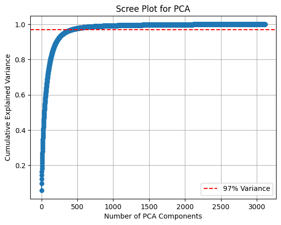
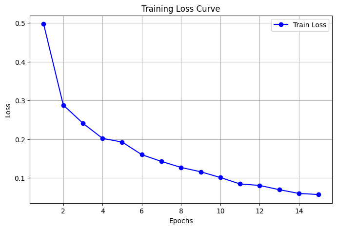
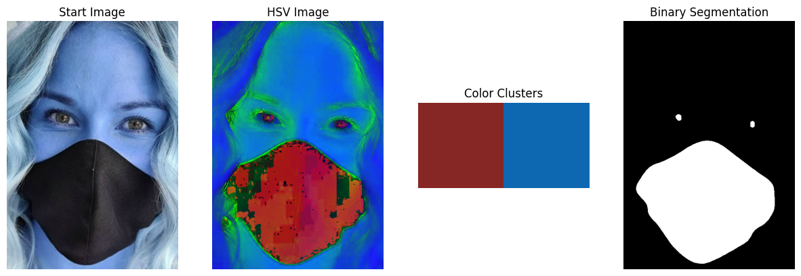
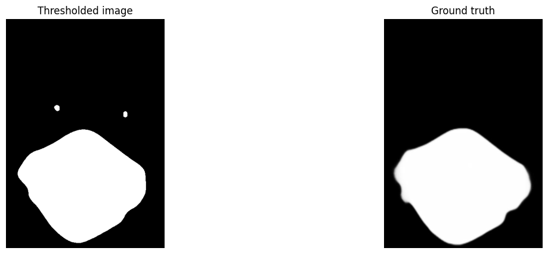

## Setting up the dataset
---------------------------------------------

1.  Open a terminal or command prompt on your operating system.

2.  Navigate to the directory where you cloned this repo.

3.  Run the below command, and press Enter to execute it.
```
pip install gdown
python setup-dataset.py
```

Two datasets will be downloaded in a `FaceMaskDataset` folder.
1. Detection and classification dataset will be in `dataset` folder.
2. Segmentation dataset will be in a zip file `MaskedFaceSegmentation.zip`, extract it manually.

Task wise folders are created, we can add our code into the respective folders.

## Task A
```
Binary Classification Using Handcrafted Features and ML Classifiers (4 Marks)
i. Extract handcrafted features from the dataset.
ii. Train and evaluate at least two machine learning classifiers (e.g., SVM, Neural
network) to classify faces as "with mask" or "without mask."
iii. Report and compare the accuracy of the classifiers.
```
The dataset count used for training and testing were as:
```
Train Set:
  No Mask (0): 1544
  Mask (1): 1572

Test Set:
  No Mask (0): 386
  Mask (1): 394
```

Image size of `64x64` was used.

Following features are extracted from the images:
- Apply the Sobel filter to detect horizontal and vertical edges.
- Extract HOG features to capture gradient orientation patterns.
- Extract LBP features to capture local texture information.
- Extract Gabor features for edge detection, texture classification, feature extraction and disparity estimation

Array shapes of the image, extracted features per image, and resulting dataset are as:
```
Image shape:  (64, 64)
Sobel feature shape:  (4096,)
HOG feature shape:  (324,)
LBP feature shape:  (256,)
Gabor feature shape:  (16384,)

Training features shape:   (3116, 21128)
Testing features shape:   (780, 21128)
```

PCA was applied on the training dataset generated above to reduce the number of features. Ideal number of components to reduce to was determined. With a threshold of 97% variance retention, a scree plot was generated for the same as:



Finally estimated optimal PCA components were `428`.

Post PCA shapes of the dataset:
```
Reduced Training features shape:   (3116, 428)
Reduced Testing features shape:   (780, 428)
```

The following models were trained with above data:
- SVM
- MLP
- Logistic regression
- Random forest

The results of each model after the final run are as shown:

### SVM

```
Training Accuracy: 0.9641  
Test Accuracy: 0.8641  
Confusion Matrix:
[[322  64]  
 [ 42 352]]
```
Classification Report (Test Set):

|               | Precision | Recall | F1-Score | Support |
|---------------|-----------|--------|----------|---------|
| 0             |    0.88   |   0.83 |   0.86   |   386   |
| 1             |    0.85   |   0.89 |   0.87   |   394   |
| Accuracy      |           |        |   0.86   |   780   |
| Macro avg     |    0.87   |   0.86 |   0.86   |   780   |
| Weighted avg  |    0.87   |   0.86 |   0.86   |   780   |


### MLP

```
Training Accuracy: 0.9791  
Test Accuracy: 0.8167 
Confusion Matrix:
[[323  63]  
 [ 80 314]] 
```
Classification Report (Test Set):

|               | Precision | Recall | F1-Score | Support |
|---------------|-----------|--------|----------|---------|
| 0             |    0.80   |   0.84 |   0.82   |   386   |
| 1             |    0.83   |   0.80 |   0.81   |   394   |
| Accuracy      |           |        |   0.82   |   780   |
| Macro avg     |    0.82   |   0.82 |   0.82   |   780   |
| Weighted avg  |    0.82   |   0.82 |   0.82   |   780   |

### Logistic

```
Training Accuracy: 0.8787  
Test Accuracy: 0.7744  
Confusion Matrix:
[[291  95]  
 [ 81 313]]
 ```

Classification Report (Test Set):

|               | Precision | Recall | F1-Score | Support |
|---------------|-----------|--------|----------|---------|
| 0             |    0.78   |   0.75 |   0.77   |   386   |
| 1             |    0.77   |   0.79 |   0.78   |   394   |
| Accuracy      |           |        |   0.77   |   780   |
| Macro avg     |    0.77   |   0.77 |   0.77   |   780   |
| Weighted avg  |    0.77   |   0.77 |   0.77   |   780   |

### Random forest

```
Training Accuracy: 1.0000  
Test Accuracy: 0.7782  
Confusion Matrix:
[[269 117]  
 [ 56 338]]
```

Classification Report (Test Set):

|               | Precision | Recall | F1-Score | Support |
|---------------|-----------|--------|----------|---------|
| 0             |    0.83   |   0.70 |   0.76   |   386   |
| 1             |    0.74   |   0.86 |   0.80   |   394   |
| Accuracy      |           |        |   0.78   |   780   |
| Macro avg     |    0.79   |   0.78 |   0.78   |   780   |
| Weighted avg  |    0.78   |   0.78 |   0.78   |   780   |


The consolidated results of all the experiments are as:
**Initial run:**

| Model | Train Acc | Test Acc | False Positives | False Negatives | F1-Score |
|-------|-----------|----------|-----------------|-----------------|----------|
| SVM   | 0.971117  | 0.851282 | 55              | 61              | 0.85     |
| MLP   | 1.000000  | 0.832051 | 57              | 74              | 0.83     |
| LR    | 0.899872  | 0.762821 | 83              | 102             | 0.76     |
| RF    | 1.000000  | 0.779487 | 113             | 59              | 0.78     |

**Applied normalization to features separately:**

| Model | Train Acc | Test Acc | False Positives | False Negatives | F1-Score |
|-------|-----------|----------|-----------------|-----------------|----------|
| SVM   | 0.922015  | 0.837179 | 57              | 70              | 0.84     |
| MLP   | 1.000000  | 0.834615 | 59              | 70              | 0.83     |
| LR    | 0.867779  | 0.751282 | 92              | 102             | 0.75     |
| RF    | 1.000000  | 0.793590 | 80              | 81              | 0.79     |

**Increasing images size from 64x64 to 96x96:**

| Model | Train Acc | Test Acc | False Positives | False Negatives | F1-Score |
|-------|-----------|----------|-----------------|-----------------|----------|
| SVM   | 0.907839  | 0.812412 | 44              | 89              | 0.81     |
| MLP   | 1.000000  | 0.815233 | 58              | 73              | 0.81     |
| LR    | 0.908898  | 0.796897 | 69              | 75              | 0.80     |
| RF    | 1.000000  | 0.775740 | 79              | 80              | 0.78     |

**Updated MLP parameters to reduce overfitting**

| Model | Train Acc | Test Acc | False Positives | False Negatives | F1-Score |
|-------|-----------|----------|-----------------|-----------------|----------|
| MLP   | 0.948799  | 0.830748 | 47              | 73              | 0.83     |

**Added Gabor features, removed normalization, 64x64 images:**

| Model | Train Acc | Test Acc | False Positives | False Negatives | F1-Score |
|-------|-----------|----------|-----------------|-----------------|----------|
| SVM   | 0.964056  | 0.864103 | 64              | 42              | 0.86     |
| MLP   | 0.979140  | 0.816667 | 63              | 80              | 0.82     |
| LR    | 0.878691  | 0.774359 | 95              | 81              | 0.77     |
| RF    | 1.000000  | 0.778205 | 117             | 56              | 0.78     |

---
## Task B

```
Binary Classification Using CNN (3 Marks)
i. Design and train a Convolutional Neural Network (CNN) to perform binary
classification on the same dataset.
ii. Try a few hyper-parameter variations (e.g., learning rate, batch size, optimizer,
activation function in the classification layer) and report the results.
iii. Compare the CNN's performance with the ML classifiers
```
We use the following CNN architecture:

```
CNN(
  (conv1): Conv2d(3, 16, kernel_size=(3, 3), stride=(1, 1), padding=(1, 1))
  
  (conv2): Conv2d(16, 32, kernel_size=(3, 3), stride=(1, 1), padding=(1, 1))
  
  (pool1): MaxPool2d(kernel_size=2, stride=2, padding=0, dilation=1, ceil_mode=False)
  
  (pool2): MaxPool2d(kernel_size=2, stride=2, padding=0, dilation=1, ceil_mode=False)
  
  (flatten): Flatten(start_dim=1, end_dim=-1)
  
  (fc1): Linear(in_features=2048, out_features=128, bias=True)
  
  (fc2): Linear(in_features=128, out_features=1, bias=True)
  
  (relu): ReLU()
  (sigmoid): Sigmoid()
)
```

The model was trained on mentioned dataset for `10` epochs. The training loss for it is as:
```
Epoch: 1  | Train Loss: 0.41242   
Epoch: 2  | Train Loss: 0.28134   
Epoch: 3  | Train Loss: 0.22790   
Epoch: 4  | Train Loss: 0.19681   
Epoch: 5  | Train Loss: 0.17420   
Epoch: 6  | Train Loss: 0.16097   
Epoch: 7  | Train Loss: 0.12542   
Epoch: 8  | Train Loss: 0.11236   
Epoch: 9  | Train Loss: 0.10507   
Epoch: 10 | Train Loss: 0.09338   
```

The graph of the same is as:



Accuracy and other related metrics obtained were as:
```
Train Accuracy : 96.61%
Test Accuracy : 95.24% 
AUC : 0.9510 
F1-Score : 0.9471
```

Confusion matrix plotted was as:
```
Confusion Matrix:
[[431  15]
 [ 24 349]]
```

Experiments ran on the CNN yeilded the following results:
|    | learning_rate | optimizer | train_accuracy | test_accuracy |        auc         |      f1_score      | epochs |
|----|----------------|-----------|----------------|----------------|--------------------|--------------------|--------|
| 0  |     0.001      |   adam    |     96.61      |     95.24      |       0.951        |       0.9471       |   10   |
| 1  |     0.01       |   adam    |     90.78      |     91.21      | 0.9162108224431648 | 0.9088607594936708 |   10   |
| 2  |     0.01       |   adam    |      98.5      |     94.26      | 0.9429212902295051 | 0.9375830013280213 |   15   |
| 3  |     0.01       |   adam    |      98.6      |     94.26      | 0.9429212902295051 | 0.9375830013280213 |   20   |
| 4  |     0.01       |    sgd    |     91.85      |     89.5       | 0.8974440664109933 | 0.8891752577319587 |   10   |
| 5  |     0.01       |    sgd    |     96.03      |     93.41      | 0.9352931629377608 | 0.9291338582677166 |   15   |
| 6  |     0.01       |    sgd    |     98.08      |     93.53      | 0.9342201757655176 | 0.9284750337381916 |   20   |
| 7  |     0.02       |   adam    |     52.46      |     54.46      |        0.5         |        0.0         |   10   |
| 8  |     0.02       |   adam    |     93.65      |     91.58      | 0.9182576130994603 | 0.9109677419354839 |   15   |
| 9  |     0.02       |   adam    |      92.7      |     88.4       |  0.88910963103668  | 0.8813982521847691 |   20   |
| 10 |     0.02       |    sgd    |     52.46      |     54.46      |        0.5         |        0.0         |   10   |
| 11 |     0.02       |    sgd    |     52.46      |     54.46      |        0.5         |        0.0         |   15   |
| 12 |     0.02       |    sgd    |     52.46      |     54.46      |        0.5         |        0.0         |   20   |

The graphs of losses in the experiments can be found in the respective jupyter notebook. 
---

## Task C
```
Region Segmentation Using Traditional Techniques (3 Marks)
i. Implement a region-based segmentation method (e.g., thresholding, edge
detection) to segment the mask regions for faces identified as "with mask."
ii. Visualize and evaluate the segmentation results.
```

Here thresholding based approach is used to segment masked regions. The approach involves:

1. Convert image to HSV colour space, to make mask region more visible
2. Perform K-Means clustering to identify two distinct colour values
3. Check for corners colour to decide background and foreground
4. Assign background cluster to 0, foreground cluster to 1
5. Apply thresholding for image

This technique works by identifying a significant colour difference between mask regions and non-mask regions in HSV colour space.

An example of segmented image and HSV space image along with detected color clusters and ground truth is as:



For the above image the scores are:
```
IOU score: 0.8287 | Dice score: 0.9063
```

More images can be found in the project's jupyter notebook.

---

## Task D
```
Mask Segmentation Using U-Net (5 Marks)
i. Train a U-Net model for precise segmentation of mask regions in the images.
ii. Compare the performance of U-Net with the traditional segmentation method
using metrics like IoU or Dice score.
```
